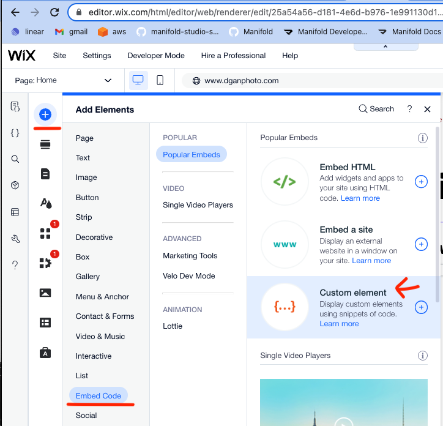
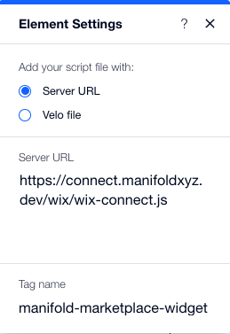

# How to install connect-widget in Wix

## Prerequisites
1. Create a Site on Wix. Then upgrade it to a paid plan & connect a domain.
(quirk with Wix -- you need to have a paid plan to inject custom code into your site. They do have a 14 day free trial.)

## Steps
1. Go to the Wix Dashboard and click Settings => Custom Code

2. Click the Button **"+ Add Custom Code"** and paste the following into the code snippet box:
```
<!-- connect widget -->
  <script async src="https://connect.manifoldxyz.dev/2.0.13/connect.umd.min.js"></script>
  <link rel="stylesheet" href="https://connect.manifoldxyz.dev/2.0.13/connect.css" />
  <!-- marketplace widget -->
  <script async src="https://marketplace.manifoldxyz.dev/latest/marketplace.umd.min.js"></script>
  <link rel="stylesheet" href="https://marketplace.manifoldxyz.dev/latest/marketplace.css" />
```
- Give it the Name "Manifold Connect Widget" and make sure to Select Place Code in "Head". Then click "Apply".

3. Now you should have what you need to install the connect-widget. Go back to the site editor for your website (editor.wix.com) then in the menu click "Add Elements" => "Embeded Code" => "Custom element"

4. A component with a grey inner box will appear on your page. Click the grey box select "Choose Source" in the Element Settings menu. Select **"Server URL"** and paste this URL into the box:
```
https://connect.manifoldxyz.dev/wix/wix-connect.js
```
also make sure to set the **"Tag Name"** to 
```
manifold-marketplace-widget
```
It should look like this:


5. (Optional) If you want the connect-widget to include WalletConnect and not just Metamask. On the custom element click "Set Attributes" => "Set Attributes". For Attribute Name enter in 
```
data-multi
```
and for Value enter in 
```
true
```
then click "Set"

6. Now on your site click "Save" and then "Publish" to make your changes live. Congratulations you should have the connect-widget installed on your site! And it should look like this.
