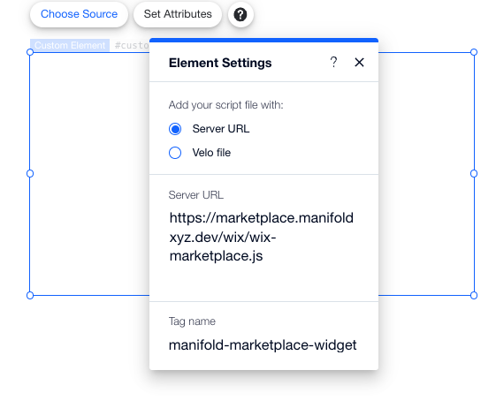
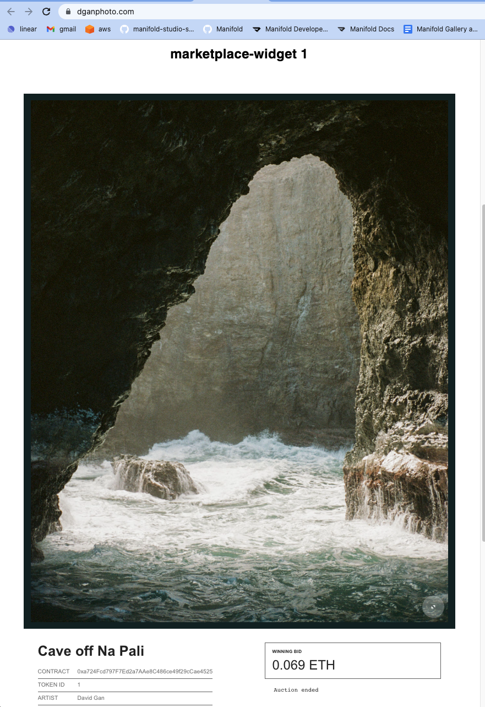

# How to install marketplace-widget in Wix

## Prerequisites
1. Create a Site on Wix. Then upgrade it to a paid plan & connect a domain.
2. Make sure you have completed the install for connect-widget onto your wix site. If you have not done so please follow the instructions [here](https://github.com/manifoldxyz/manifold-templates/tree/main/connect-widget/wix)

## Steps
1. Start at the site editor for your website (editor.wix.com) then in the menu click "Add Elements" => "Embeded Code" => "Custom element" <br />

2. A component with a grey inner box will appear on your page. Click the grey box and select "Choose Source" in the Element Settings menu. Select **"Server URL"** and paste this URL into the box:
```
https://marketplace.manifoldxyz.dev/wix/wix-marketplace.js
```
also make sure to set the **"Tag Name"** to 
```
manifold-marketplace-widget
```
It should look like this: <br />
 <br />

3. On the custom element click "Set Attributes" => "Set Attributes". For Attribute Name enter in the 3 following attributes:
```
data-widget  :  m-layout-complete-listing
data-id  :  {whatever listingId you want to display}
data-network  :  {1 for Ethereum Mainnet or 5 for Goerli}
```
then click "Set". It should look like this: <br />
 <br />

4. Add Velo to your site. Go to `https://www.wix.com/velo` and click "Start a Project" then click your paid site.
5. Back in your site editor for each page on your app. Copy and paste the following velo code. What does this do? All it does is do a refresh everytime you click a new tab, which helps to get rid of bugs with the integration.
```
import {session} from 'wix-storage';
import wixLocation from 'wix-location';

$w.onReady(function () {
  let loaded = session.getItem("loaded")
  if (loaded === "true") {
    session.setItem("loaded","false")
  } else {
    session.setItem("loaded","true")
    wixLocation.to(wixLocation.url)
  }
})
```
<br />
6. Now on your site click "Save" and then "Publish" to make your changes live. Congratulations you should have a mareketplace-widget installed that allows users to bid on a listing directly within your site! <br />


## Troubleshooting
If you have issues with widgets not showing up try to refresh. If still persisting something that could help is 
moving the `https://marketplace.manifoldxyz.dev/wix/wix-marketplace.js` script file directly into your site as a velo script. And change the embed compoents to use the local file instead of the remote one.

## Optional Styling For A Dark Background Wix Site
1. In the wix dashboard for the site (not the site editor). Click Settings => Custom Code => "+ Add Custom Code"
2. Copy and paste the following code into the box:
```
<style>
  .manifold {color: white !important;}
  .m-complete-view .m-listing-info .m-aside>button { color: white !important; }
  .m-layout-listing .m-listing-info .m-main .m-attributes *, .manifold.m-layout-listing .m-listing-info .m-main .m-attributes * { color: white !important;}
  .m-layout-listing .m-listing-info .m-main .m-description:before, .manifold.m-layout-listing .m-listing-info .m-main .m-description:before { color: white !important;}
  .m-description p { color: white !important;}
  .m-bids-inner {background: transparent !important;}
  .m-bid .m-bid-timestamp {background: transparent !important;}
  .m-bid .m-bid-bidder {background: transparent !important;}
  .m-bid .m-bid-amount {background: transparent !important;}
  .m-bid .m-bid-referrer {background: transparent !important;}
  .m-bid a {filter: none !important;}
  .m-bids .m-bids-header {width: auto !important}
  .m-bids-inner { padding-top: 30px }

  .manifold.m-confirm .m-confirm-inner { align-content: center;
    justify-content: center;
    align-items: center;
    justify-items: center; }
  .manifold.m-confirm .m-confirm-inner>div { width: auto; height: auto;}
  .m-rich-form-input-inner>input { padding-right: 10px !important;}
</style>
```
- you can select a specific page to have this style or you can put it on all pages.
- place Code in the  "Head" section
3. Click "Apply" to save the changes.

## Optional Styling For A Light Background Wix Site
```
<style>
  .manifold {color: black !important;}
  .m-complete-view .m-listing-info .m-aside>button { color: black !important; }
  .m-layout-listing .m-listing-info .m-main .m-attributes *, .manifold.m-layout-listing .m-listing-info .m-main .m-attributes * { color: black !important;}
  .m-layout-listing .m-listing-info .m-main .m-description:before, .manifold.m-layout-listing .m-listing-info .m-main .m-description:before { color: black !important;}
  .m-description p { color: black !important;}
  .m-complete-view .m-listing-info .m-aside .m-subscribe-to-listing-button {color: white !important;} 
  .m-bids-inner {background: transparent !important;}
  .m-bid .m-bid-timestamp {background: transparent !important;}
  .m-bid .m-bid-bidder {background: transparent !important;}
  .m-bid .m-bid-amount {background: transparent !important;}
  .m-bid .m-bid-referrer {background: transparent !important;}
  .m-bids .m-bids-header {width: auto !important}
  .m-bids-inner { padding-top: 30px }

  .manifold.m-confirm .m-confirm-inner { align-content: center;
    justify-content: center;
    align-items: center;
    justify-items: center; }
  .manifold.m-confirm .m-confirm-inner>div { width: auto; height: auto;}
  .m-rich-form-input-inner>input { padding-right: 10px !important;}
</style>
```