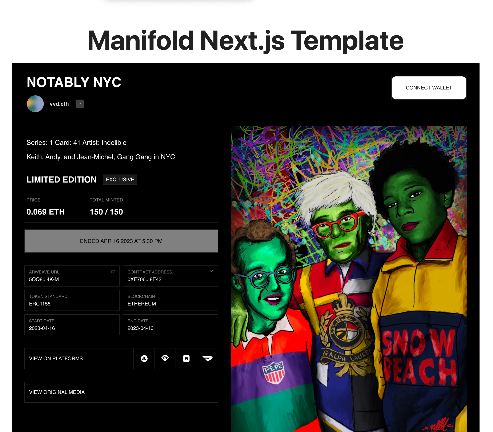

# Claim Page (NON-FUNCTIONAL)

This is a simple example of a Claim Page.

This was created using the standard `create-next-app` script.

## Configuration
Please make sure you create your own env file and set `NEXT_APP_NETWORK` and `NEXT_APP_CLAIM_ID` values.\
An example configuration file can be found at [`.env.example`](./.env.example).

## How does it work?
In this example, we are adding a dependency to the [Connect Widget](https://docs.manifold.xyz/v/manifold-for-developers/resources/widgets/connect-widget) and a [Claim Widget](https://docs.manifold.xyz/v/manifold-for-developers/resources/widgets/claim-widgets/widgets/complete-claim-widget#m-claim-complete) which will display a claim listing.

The scripts and stylesheets are included in [`_document.js`](./pages/_document.js) as part of the `head` HTML tag.

## Available Scripts

In the project directory, you can run:

### `yarn start`

Runs the app in the development mode.\
Open [http://localhost:3000](http://localhost:3000) to view it in your browser.

The page will reload when you make changes.\
You may also see any lint errors in the console.

### `yarn test`

Launches the test runner in the interactive watch mode.\
See the section about [running tests](https://facebook.github.io/create-react-app/docs/running-tests) for more information.

### `yarn run build`

Builds the app for production to the `build` folder.\
It correctly bundles React in production mode and optimizes the build for the best performance.

The build is minified and the filenames include the hashes.\
Your app is ready to be deployed!

See the section about [deployment](https://facebook.github.io/create-react-app/docs/deployment) for more information.
