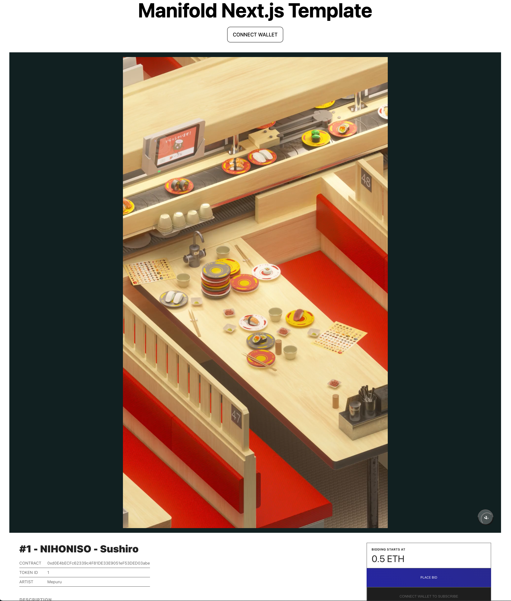

# Marketplace Listing Page - Next.js

This is a simple example of an Marketplace Listing Page. Created using the standard `create-next-app` script.
You can see a deployed version of this template at [https://manifold-nextjs-template-marketplace.vercel.app/](https://manifold-nextjs-template-marketplace.vercel.app/)

## Configuration
Create an a file called `.env.local` in the root of the project. Copy and paste the values from `env.example` into the `.env.local` file and fill those values in with your own. `DATA_NETWORK` is required (`1` for Mainnet and `5` for Goerli) and `DATA_FALLBACK_PROVIDER` is optional if you want people to see your site even if they do not have Metamask installed on their browser.

## Available Scripts
In the project directory, you can run:

`yarn start`
Open http://localhost:3000 to view it in your browser.

The page will reload when you make changes.
You may also see any lint errors in the console.

`yarn build`
Builds the app for production.
