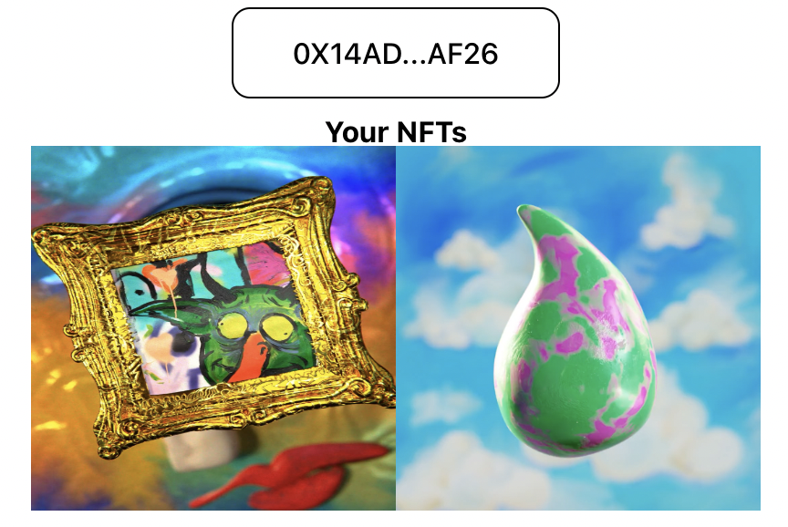

# NFT Profile Page

This is a simple example of an NFT Profile Page. It contains a way for someone to connect their wallet and view their NFTs.

This was created using the standard create-next-app script.

## Configuration
Please make sure you set the NEXT_APP_NETWORK, NEXT_APP_MANIFOLD_APP_NAME and NEXT_APP_MANIFOLD_CLIENT_ID in the .env or your own .env.local.

## How does it work?
In this example, we are adding a [Connect Widget](https://docs.manifold.xyz/v/manifold-for-developers/resources/widgets/connect-widget), which will allow a user to authenticate to your website.  Once authenticated, your app will have access to a [Data Client](https://docs.manifold.xyz/v/manifold-for-developers/resources/widgets/connect-widget/data-client), which allows you to retrieve information about the user's NFTs.

## Available Scripts

In the project directory, you can run:

### `yarn start`

Runs the app in the development mode.\
Open [http://localhost:3000](http://localhost:3000) to view it in your browser.

The page will reload when you make changes.\
You may also see any lint errors in the console.

### `yarn test`

Launches the test runner in the interactive watch mode.\
See the section about [running tests](https://facebook.github.io/create-react-app/docs/running-tests) for more information.

### `yarn run build`

Builds the app for production to the `build` folder.\
It correctly bundles React in production mode and optimizes the build for the best performance.

The build is minified and the filenames include the hashes.\
Your app is ready to be deployed!

See the section about [deployment](https://facebook.github.io/create-react-app/docs/deployment) for more information.
