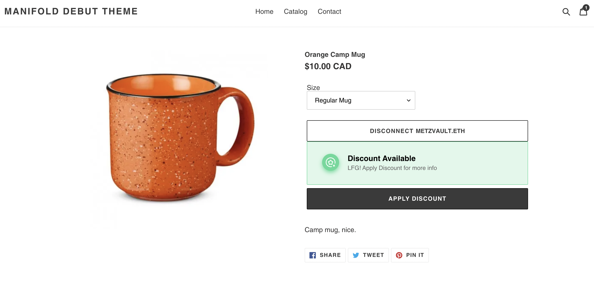
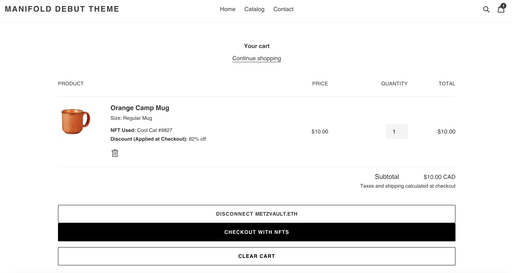
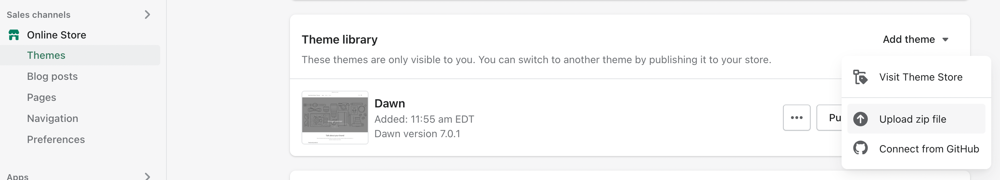

# Merch Bridge enabled for the Shopify Debut theme
This is a modified version of the [Shopify Debut](https://themes.shopify.com/themes/debut/styles/default) theme which enables the Manifold Merch Bridge.

### Product Page

### Checkout Page

## Installation
To use this theme, download merch_bridge.zip and follow these intructions.

1. From your Shopify admin, go to **Online Store > Themes**.
2. In the Theme Library section, click **Add Theme > Upload Zip File**.
3. Select the downloaded merch_bridge.zip and upload it

## How it works
You can look at merch_bridge.diff to see what changed between the default Debut theme and the merch bridge enabled version.

Two core snippets were added:
1. manifold-campaign-widget.liquid
2. manifold-checkout-widget.liquid

These two snippets add the basic product page and checkout functionality to the project.

With these widgets added, they need to be rendered into the appropriate product and checkout pages, as well as replace certain default elements on the theme (e.g. the 'Add To Cart' and 'Checkout' buttons).  Those are changes to the various sections in the theme.