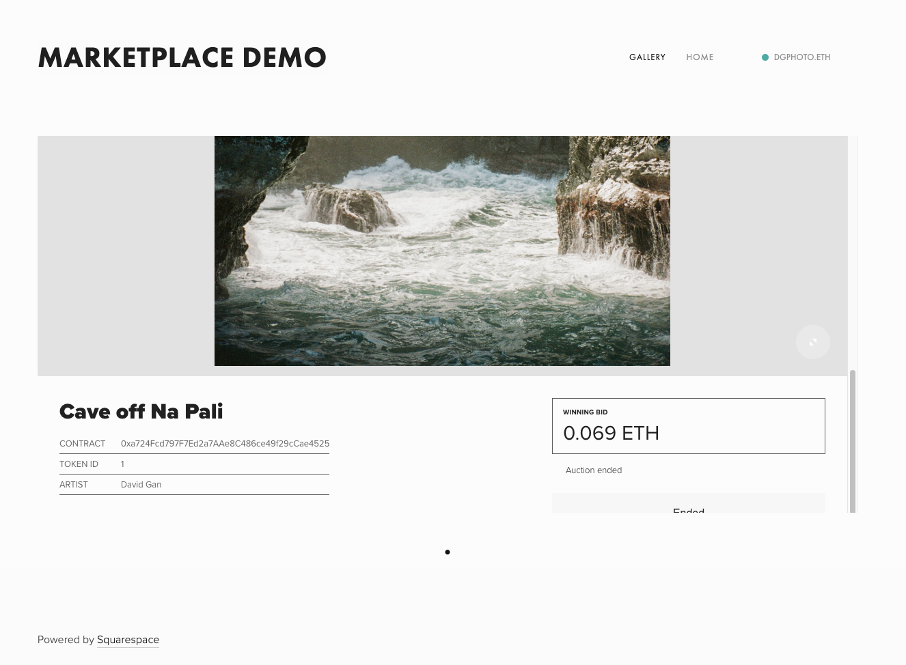
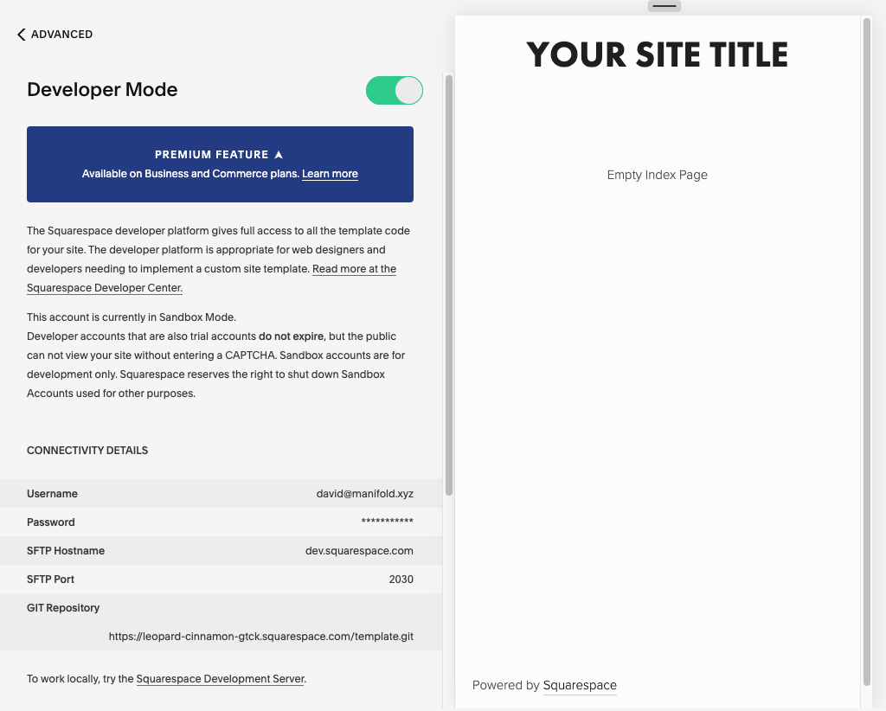
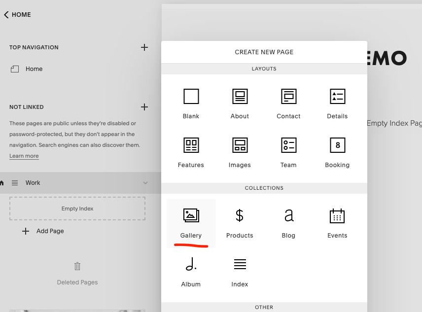
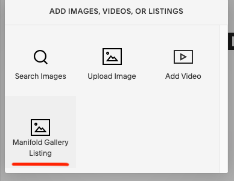

# Squarespace Marketplace Site

<!--  -->


This is an example of a Squarespace template with custom developer code to integrate Manifold Marketplace widgets.

## How does it work?

We fork a v7.0 Squarespace template ([Avenue](https://www.squarespace.com/templates/avenue-demo)), inject the [Connect Widget](https://docs.manifold.xyz/v/manifold-for-developers/resources/widgets/connect-widget) and the [Marketplace Widget](https://docs.manifold.xyz/v/manifold-for-developers/resources/widgets/marketplace-widgets) code site-wide, add a custom post type, and tell Squarespace's CMS how we want to display said custom post type.

## Changes to SquareSpace Template

### Code injection

We inject Connect and Marketplace Widget JS and CSS in the `head` tag of [`site.region`](./site.region).

### Connect widget in header

[`navigation.block`](./blocks/navigation.block) includes a `div` with the `data-`attributes required for displaying a connect widget. Using the `div`'s id, the injected connect widget is styled in [`connect-widget.less`](./styles/connect-widget.less) (that file is also included in [`template.conf`](./template.conf)'s `stylesheets` array).

### Custom post type definition

We define a custom post type called "Manifold Gallery Listing" so that:

1. we can group the listing ID and network data;
2. it is accessible through the CMS;
3. we can display this post type in a customised way.

We define this type in [`template.conf`](./template.conf)'s `customTypes`' array.

The `manifoldGalleryListing` type:

```json
{
  "title": "Manifold Gallery Listing",
  "name": "manifoldGalleryListing",
  "base": "image",
  "fields": [
    {
      "name": "listingId",
      "title": "Listing ID",
      "type": "text"
    },
    {
      "name": "network",
      "title": "Network",
      "type": "text"
    },
    {
      "name": "version",
      "title": "Marketplace Version",
      "type": "text"
    },
    {
      "name": "useListingName",
      "title": "Use On-Chain Listing Name",
      "type": "checkbox"
    },
    {
      "name": "useListingDescription",
      "title": "Use On-Chain Listing Description",
      "type": "checkbox"
    }
  ]
}
```

### Custom post type display

The custom post type is included in the `acceptedTypes` array of [`gallery.conf`](./collections/gallery.conf). In [`gallery.list`](./collections/gallery.list), we define how we want to display the `manifoldGalleryListing` type:

```jsont
<div id="slideshow">
  {.repeated section items}
    <div class="slide" data-slide-id="{id}" data-slide-url="{urlId}">
      {.equal? customContent.customType "manifoldGalleryListing"}
        {.section customContent}
          <div data-widget="m-layout-complete-listing" data-id="{@.listingId}" data-network="{@.network}"></div>
        {.end}
      {.or}
        {.image?}
          
          <noscript></noscript>
        {.end}
        {.video?}{@|video}{.end}
      {.end}
    </div>
  {.end}
</div>
```

For this template, `index.list` handles `gallery` collections differently, so we also update [`index.list`](./collections/index.list)'s way of displaying `manifoldGalleryListing` posts.

### Styling

Marketplace widget styling is included in [`marketplace-widget.less`](./styles/marketplace-widget.less) (that file is also included in [`template.conf`](./template.conf)'s `stylesheets` array).

[`site-overrides.less`](./styles/site-overrides.less) includes site overrides.

## Steps
1. Go to your site (we are using the Avenue Template) and click Settings => Advanced => Code Injection. Then activate Developer Mode. You should see a "Connectivity Details" section pop up.
 <br />
2. Open a new terminal and `git clone <Git Repository link in Connectivity Details>`
3. Now either copy and paste all the code in this repo into the cloned repo or make all the changes found in **Changes to SquareSpace Template** section above. 
4. Then save/push your changes to the repo by doing 
  - `git add -A`
  - `git commit -m "your message"`
  - `git push` 
5. Now go back to your Squarespace site editor and add a new page. You should see a new **Gallery** option in the Collections section. Click it to add a new Gallery page.
 <br />
6. On the new component on the new page click "Add Images, Videos, or Listings" then click "Manifold Gallery Listing".
 <br />
7. Click on the section "Manifold Gallery Listing" and fill out the fields with your information. (Network is 1 for Mainnet and set Marketplace Version to 2).
then make sure to click "Save & Publish".