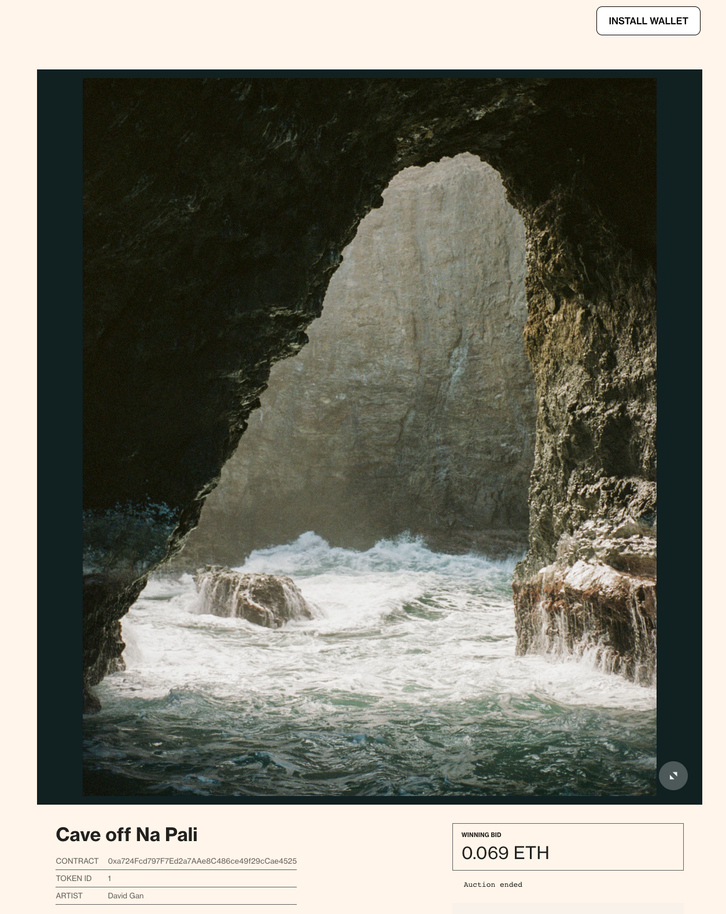
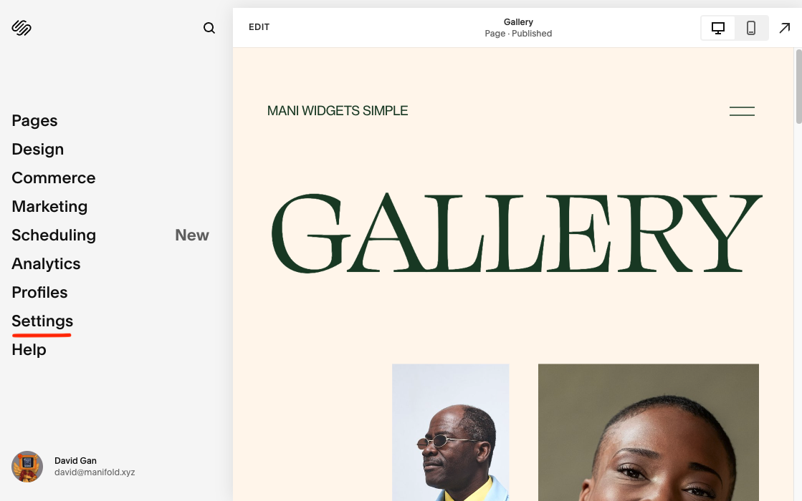
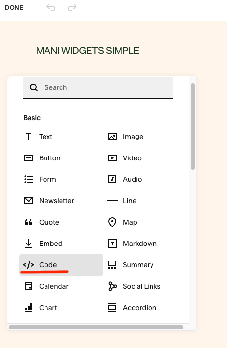
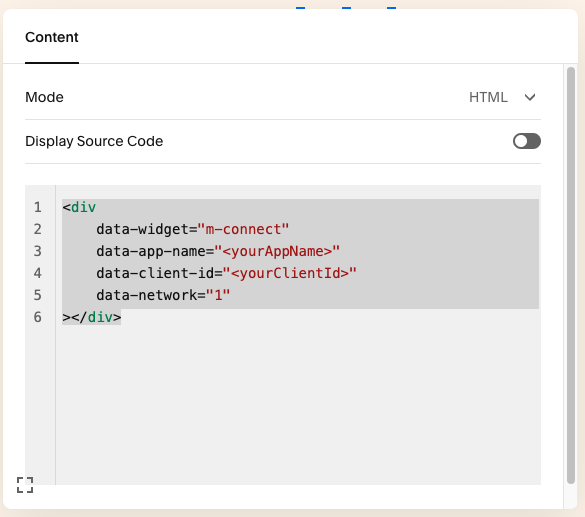
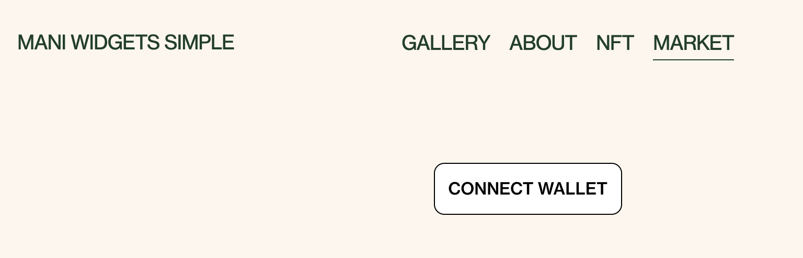

# Simple Squarespace Marketplace Site



This is a simple example of a Marketplace Listing Page

## How does it work?
In this example, we are adding a [Connect Widget](https://docs.manifold.xyz/v/manifold-for-developers/resources/widgets/connect-widget) and a [Marketplace Widget](https://docs.manifold.xyz/v/manifold-for-developers/resources/widgets/marketplace-widgets) which will display a marketplace listing.

## Prerequisites
1. Create a Site on Squarespace.

## Steps
### Install Widgets
1. Go to site editor and click Settings => Advanced => Code Injection
 <br />
2. Copy and paste the following into the **Header** code snippet box:
```
<!-- connect widget -->
<script async src="https://connect.manifoldxyz.dev/2.0.13/connect.umd.min.js"></script>
<link rel="stylesheet" href="https://connect.manifoldxyz.dev/2.0.13/connect.css" />
<!-- marketplace widget -->
<script async src="https://marketplace.manifoldxyz.dev/latest/marketplace.umd.min.js"></script>
<link rel="stylesheet" href="https://marketplace.manifoldxyz.dev/latest/marketplace.css" />
```
 <br />

### Add Connect-Widget
3. Go into the editor for a page on your website. Click "Add Block" => "Code". A new component should appear.
 <br />

4. Click the new code component and click the Edit button. **Copy and paste the following into the box**: 
make sure to replace the variables with your own values.
```
<div
  data-widget="m-connect"
  data-app-name="<yourAppName>"
  data-client-id="<yourClientId>"
  data-network="<1 for Mainnet or 5 for Goerli>"
></div>
```
 <br />

5. Click Done/Save. And you should see the Connect Widget appear on your page.
 <br />

### Add the Marketplace-Widget
6. Add another code block (just as you did in step 3). Click the Edit button and **Copy and paste the following into the box**:
```
<div
  data-widget="m-layout-complete-listing"
  data-id="<yourListingId>"
  data-network="<1 for Mainnet or 5 for Goerli>"
></div>
```
 <br />

5. Click Done/Save. Congratulations! You should see the marketplace widget appear on your page. And now you have both the Connect Widget and the Marketplace Widget on your page.
