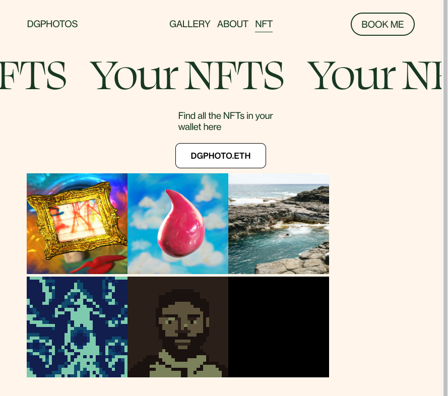
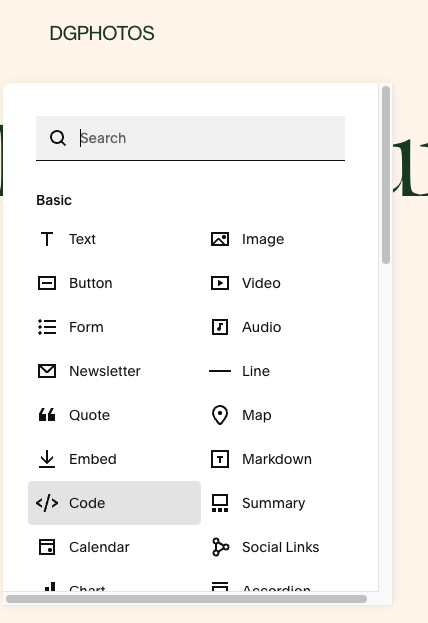
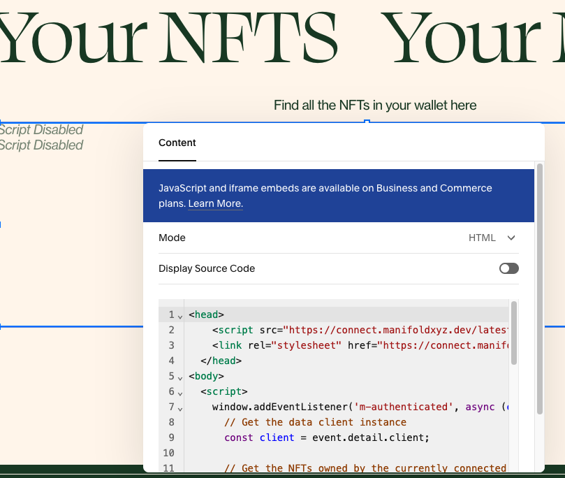

# Squarespace NFT Profile Page



This is a simple example of an NFT Profile Page. It contains a way for someone to connect their wallet and view their NFTs.

## Configuration
Please make sure you set the `data-app-name`, `data-client-id` and `data-network` in the index.html file.

## How does it work?
In this example, we are adding a [Connect Widget](https://docs.manifold.xyz/v/manifold-for-developers/resources/widgets/connect-widget), which will allow a user to authenticate to your website.  Once authenticated, your app will have access to a [Data Client](https://docs.manifold.xyz/v/manifold-for-developers/resources/widgets/connect-widget/data-client), which allows you to retrieve information about the user's NFTs.

## Steps
1. Go to the site editor for your website (editor.wix.com) and  click "Add Block" => "Code"<br />

2. A component box will appear on your page. Click it and press the edit button. **Copy and paste the following into the box** (make sure to replace the variables found in Configuration):
```
<head>
    <script src="https://connect.manifoldxyz.dev/latest/connect.umd.min.js"></script>
    <link rel="stylesheet" href="https://connect.manifoldxyz.dev/latest/connect.css">
  </head>
<body>
  <script>
    window.addEventListener('m-authenticated', async (event) => {
      // Get the data client instance
      const client = event.detail.client;

      // Get the NFTs owned by the currently connected wallet
      const tokens = await client.getNFTsOfOwner();

      // Create a div element for each token you own
      for (let i = 0; i < tokens.length; i++) {
        const img = document.createElement("img");
        img.src = tokens[i].image;
        img.height = 200;
        img.width = 200;
        document.getElementById("nfts").appendChild(img);
      }
    })
    window.addEventListener('m-unauthenticated', async (event) => {
      document.getElementById("nfts").innerHTML = "";
    })
  </script>
  <div>
    <div
      data-widget="m-connect"
      data-app-name="YOUR-APP-NAME"
      data-client-id="YOUR-CLIENT-ID"
      data-network="NETWORK"
      style="margin-top: 10px; margin-bottom: 10px; display: flex; flex-direction: row; justify-content: center;"
    >
  </div>
  <div id="nfts"></div>
</body>
```
<br/>


